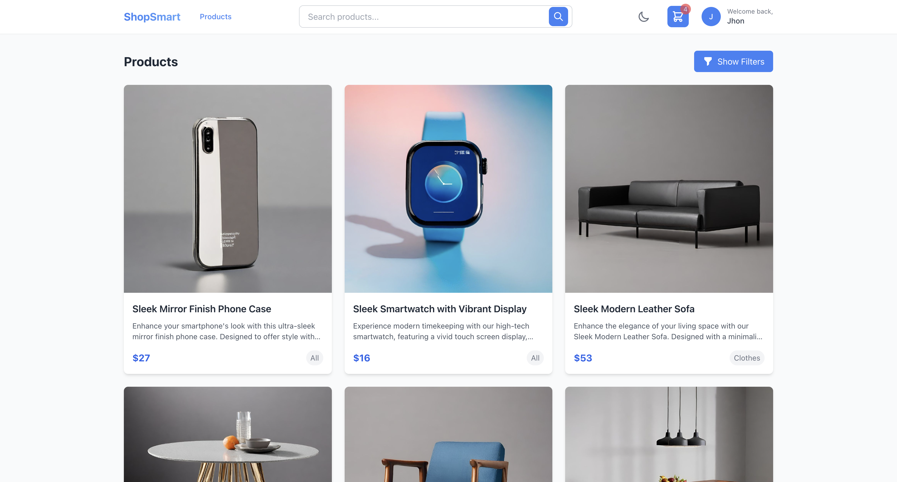
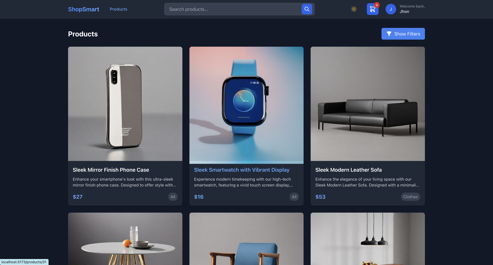
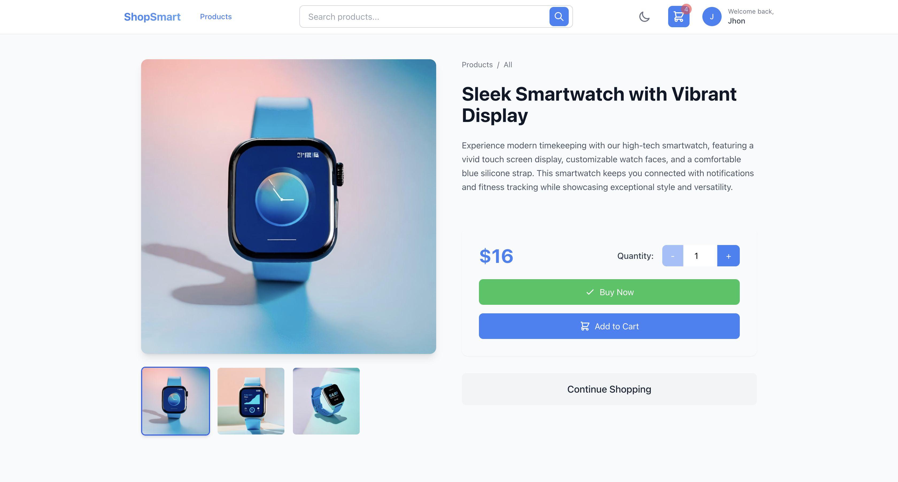
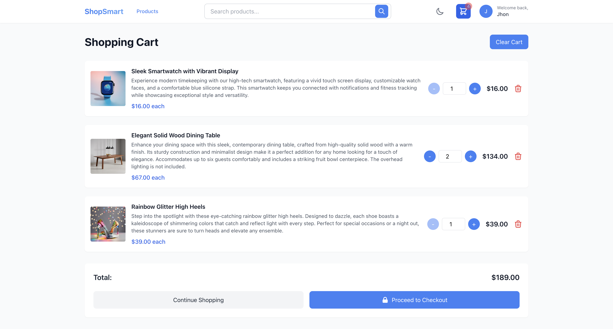
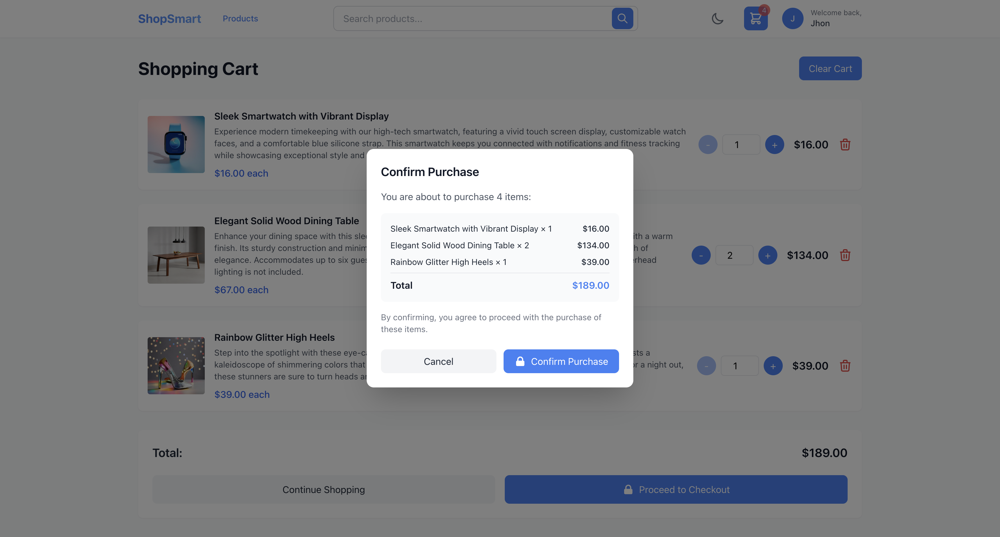
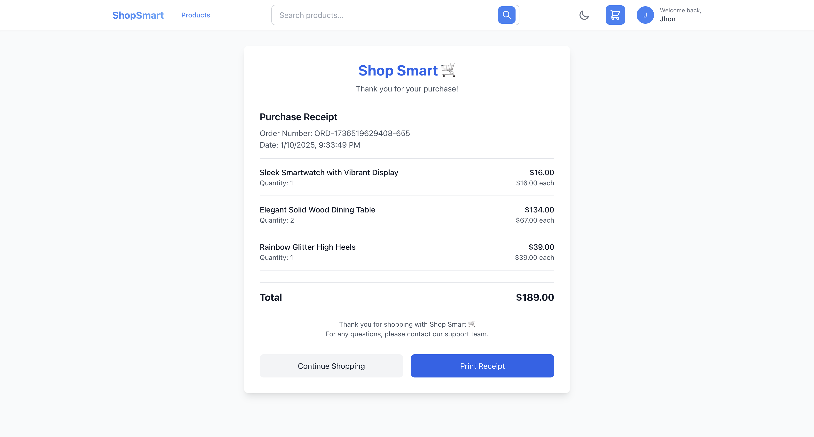
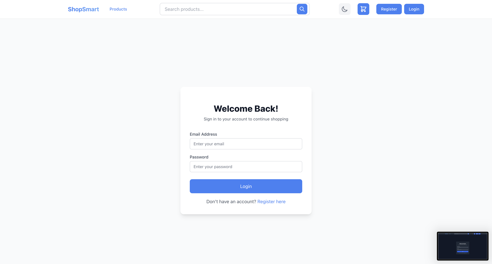
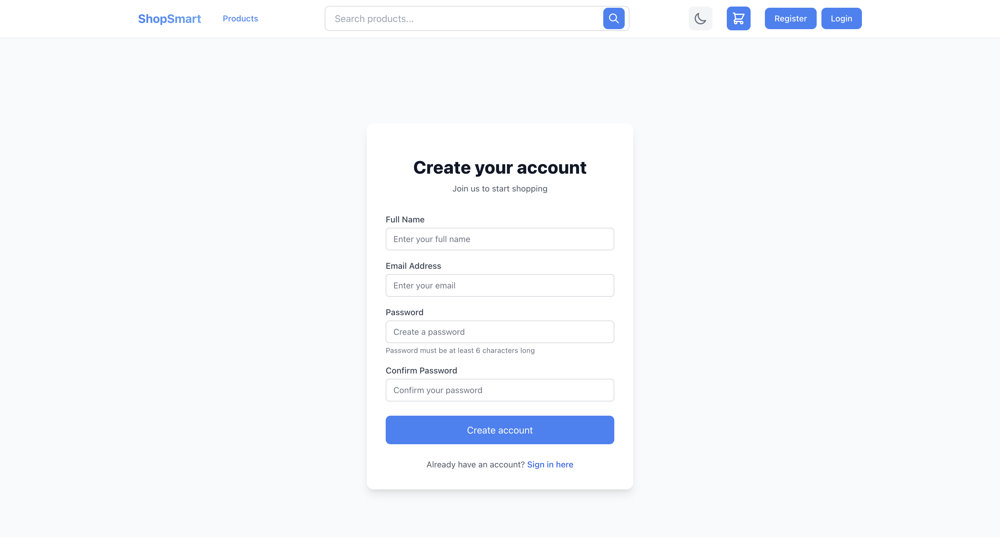

# ShopSmart - Modern E-commerce Platform

[](https://shopsmart-react.netlify.app)


## Overview

ShopSmart is a modern e-commerce platform built with React, TypeScript, and Tailwind CSS. It offers a seamless shopping experience with features like dark mode support, real-time cart management, and a streamlined checkout process.

 [Live Demo](https://shopsmart-react.netlify.app)

 **Demo Account**
 
 email: john@mail.com
 
 password: changeme

 *This account are already registered in the API. You can also register your own account*

## Screenshots

### Home Page (Light/Dark Mode)
<div style="display: flex; gap: 10px;">
  
  
</div>

### Product Detail & Purchase Flow
<div style="display: flex; gap: 10px; flex-wrap: wrap;">
  
  
  
  
</div>

### Authentication Pages
<div style="display: flex; gap: 10px;">
  
  
</div>

## Features

### User Authentication
- Secure login and registration system
- Protected routes for authenticated users
- Persistent user sessions

### Product Management
- Browse products with dynamic filtering
- Advanced search functionality
- Detailed product views with image galleries
- Category-based navigation

### Shopping Experience
- Real-time cart management
- Quick "Buy Now" option
- Persistent shopping cart across sessions
- User-specific cart storage

### UI/UX
- Responsive design for all devices
- Dark mode support
- Modern and clean interface
- Smooth animations and transitions
- Loading states and error handling

### Checkout Process
- Streamlined checkout flow
- Order confirmation
- Digital receipt generation
- Order history tracking

## Technologies Used

### Core
- React 18
- TypeScript
- Vite
- TailwindCSS

### State Management
- React Context API
- Local Storage for persistence

### Styling
- Tailwind CSS for styling
- Heroicons for icons
- Custom animations

### API Integration
- Fetch API for data fetching
- REST API integration

## Installation

1. Clone the repository:
```bash
git clone https://github.com/yourusername/shopsmart.git
```

2. Install dependencies:
```bash
cd shopsmart
npm install
```

3. Create a `.env` file in the root directory and add necessary environment variables:
```env
VITE_API_URL=your_api_url
```

4. Start the development server:
```bash
npm run dev
```

5. Build for production:
```bash
npm run build
```

## Project Structure

```
src/
├── components/     # Reusable UI components
├── context/       # React Context providers
├── pages/         # Page components
├── types/         # TypeScript type definitions
├── utils/         # Utility functions
└── App.tsx        # Root component
```

## Key Features in Detail

### Dark Mode
- System preference detection
- Manual toggle option
- Persistent theme preference
- Smooth transition effects

### Shopping Cart
- Real-time updates
- Quantity management
- Price calculations
- Cart persistence

### Product Search
- Instant search results
- Filter by category
- Sort by price and relevance
- Clear search functionality

### Responsive Design
- Mobile-first approach
- Tablet optimization
- Desktop enhancement
- Consistent experience across devices

## Contributing

1. Fork the repository
2. Create your feature branch (`git checkout -b feature/AmazingFeature`)
3. Commit your changes (`git commit -m 'Add some AmazingFeature'`)
4. Push to the branch (`git push origin feature/AmazingFeature`)
5. Open a Pull Request

## License

This project is licensed under the MIT License - see the [LICENSE](LICENSE) file for details.

## Acknowledgments

- Design inspiration from modern e-commerce platforms
- Icons from Heroicons
- API provided by Platzi Fake Store API
